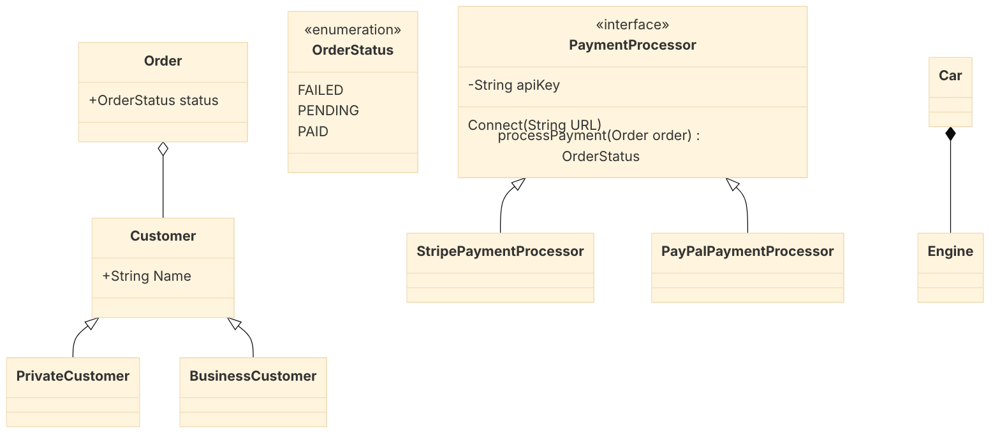

# Mermaid

[CheatSheet](https://jojozhuang.github.io/tutorial/mermaid-cheat-sheet/)

Take into account that, about the placement, the only thing that determines the
location are the links. You can set: 

- Height of the blocks: For example,
  `Customer <|-- PrivateCustomer` will have `Customer` above than `PrivateCustomer`. The
  direction of the link it does not affect, only the worder of the words.
  `PrivateCustomer --|> Customer` will have `PrivateCustomer` above `Customer`

- Width: Depending on the order of the classes, this will affect the order of them in
  the horizontal axis.

Example code to generate class diagrams.

